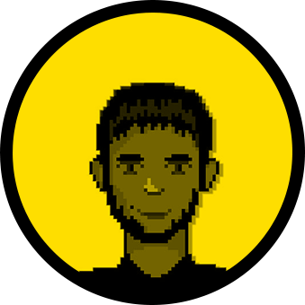

<figure>
  
  <figcaption>
   Laureano. por <a href="https://www.instagram.com/matzpxl/" target="_blank">@matzpxl</a>.
  </figcaption>
</figure>

### Sobre o meu trabalho:
OLAR! Meu nome é Laureano e eu sou um produtor audiovisual da Paraíba. Produzo conteúdo em vídeo de ponta a ponta, isto é: desde a conceituação da ideia, passando pela construção do roteiro, captação de imagens e áudio, edição, finalização e distribuição online de produtos audiovisuais. Além disso sou comunicólogo, então também estou apto a trabalhar com vários aspectos da assessoria de comunicação, como assessoria de imprensa, gestão de mídias e marcas, endomarketing, construção de conteúdos de treinamento, programação para TV Corporativa... 

Pra resumir, sou um **cineasta/produtor audiovisual e um técnico em comunicação estratégica.**

### Sobre a minha arte:
Sim, audiovisual é uma arte, mas a minha visão de produção dele é bem mais técnica do que artística, visto o tipo de fluxo de trabalho que a área demanda. Além disso, minha escola artística é o **Teatro**, então todo o meu repertório artístico teve como início as artes cênicas em 2002, chegando no audiovisual mais de uma década depois. Escrevo histórias desde 2006, mas já me aventurei por crônicas, poemas, conteúdo jornalístico e até cordel. Fotografo como hobby - *e freela para projetos seletos* -, brinco de fazer música e jogos e como sou realmente viciado em experimentar coisas novas, já flertei até com a arte da Performance. Porém, como artista propriamente dito, só me levo à sério _(além de videomaker)_ como **argumentista cinematográfico**, por ser o meu foco de estudos e prática atualmente. Essas são as minhas produções artísticas principais: vídeos e argumentos cinematográficos.

### Sobre esse site:
Sou entusiasta do movimento de código aberto e do compartilhamento de informação. Acredito piamente que estas são ferramentas de desenvolvimento pessoal e principalmente de emancipação humana. Meu site não poderia ser diferente, por isso resolvi construí-lo 100% com ferramentas abertas e quero compartilhá-las contigo caso você queira fazer um site gratuito como esse, seja pra juntar seu próprio conteúdo ou pra se organizar em um grupo de [_Agitprop_](https://pt.wikipedia.org/wiki/Agitprop){:target="_blank"}, talvez...? Você não precisa saber absolutamente nada sobre construção de sites - como nota-se nas categorias acima nada aponta meu conhecimento em _webdev_, pois eu nunca fiz nem um curso de HTML básico, tudo o que aprendi foi pesquisando no _Google_ - a única ferramenta necessária é vontade de aprender (e algumas contas e softwares gratuitos, claro heh 😅). Como base, esse site usa o gerador de sites estáticos [*Jekyll*](https://jekyllrb.com/){:target="_blank"}, hospedado em um repositório no [*GitHub*](https://github.com){:target="_blank"}. Já pra editar esse bolo de código, uso o software  de edição de texto código aberto da Adobe, o [*Brackets*](http://brackets.io/){:target="_blank"}. E no miolo desse site, todo o conteúdo

Pro visual preciso de um paragrafo exclusivo pra explicar. Esse tema pro jekyll foi feito por [*Pat Dryburgh*](https://patdryburgh.com/){:target="_blank"}, um designer canadense que teve a maravilhosa ideia de transformar a capa do livro [*Arguably*](https://amzn.to/38eqCWV){:target="_blank"} em um tema para escritores. Arguably, por sua vez, é do autor Christopher Hitchens, que desde minha adolescência é uma grande referência pra mim de pensador livre, humanista secular e racionalista ferrenho. Mas para descrevê-lo, faço das palavras do Pat as minhas: "Indubitavelmente uma das maiores mentes dos nossos tempos, Christopher Hitchens desafiou seus leitores a pensarem profundamente sobre política, religião, guerra e ciência. Este tema para Jekyll foi desenhado em sua memória". E, consequentemente, me aproveito do Pat que se aproveitou da capa do livro pra invocar essa identidade visual pra mim como homenagem e gesto de admiração.

### Sobre mim:
Eu não sou importante. O que interessa é o que eu faço e esse site é em si uma obra em ode a tudo que eu faço e amo. Mas se bateu a curiosidade e você quiser saber sobre algo específico, [*bora trocar uma ideia, pô!*](contato.html).
